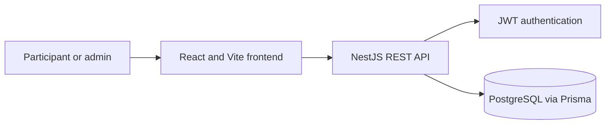

<div align="center">

# World Cup Prediction League

> Public source edition. Configure credentials locally and use empty or synthetic inputs. Company and institution names identify the original integration context; this repository does not claim affiliation or endorsement.
An end-to-end prediction game for group standings, knockout matches, and a shared leaderboard.

**React · NestJS · PostgreSQL · Prisma**

</div>

## Overview

Participants submit tournament predictions while administrators approve accounts and manage the competition. A React client communicates with a NestJS API backed by PostgreSQL.

## Highlights

- Account registration with approval and role-based access.
- Group-stage and knockout-stage predictions.
- Scoring and leaderboard endpoints.
- Prisma schema, migrations, and tournament seed data.

## Architecture



## Tech stack

- **Frontend:** React, TypeScript, Vite, Tailwind CSS, Axios.
- **Backend:** NestJS, TypeScript, Passport JWT.
- **Data:** PostgreSQL and Prisma.
- **Deployment configuration:** Render API manifest and Vercel frontend configuration.

## Run locally

Requires Node.js and Docker Compose. Copy `backend/.env.example` to `backend/.env`, replace every placeholder, then run PostgreSQL from `backend/` with `docker compose up -d`.

In `backend/`, run `npm install`, `npx prisma generate`, `npx prisma migrate dev`, `npx prisma db seed`, and `npm run start:dev`. In `frontend/`, run `npm install` and `npm run dev`. The API defaults to port `3000`; the frontend defaults to `http://localhost:3000` for API requests and port `5173` for Vite.

The first administrator is created only when no administrator exists. Set `FIRST_ADMIN_EMAIL` and `FIRST_ADMIN_PASSWORD` (at least 16 characters) before the initial seed. Generate a JWT secret with `node -e "console.log(require('crypto').randomBytes(48).toString('base64'))"`. Never commit a populated `.env` file.


## Tests

From `backend/`, `npm test` runs unit tests and `npm run test:e2e` runs the end-to-end suite.

## Project layout

```text
backend/   NestJS API, Prisma schema, migrations, seed
frontend/  React client and Vite configuration
```

No license is defined in this repository.
